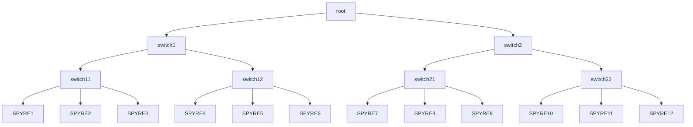
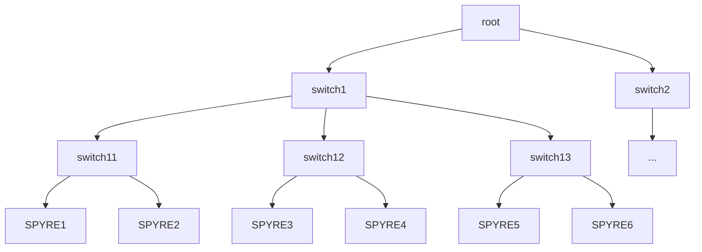

# IBM AIU Spyre Operator User Guide

## Table of Contents <!-- omit in toc -->

- [Quick Start](#quick-start)
- [Available Resource Names](#available-resource-names)
- [Allocation Modes](#allocation-modes)
  - [Simple Allocation](#simple-allocation)
  - [Per Device Allocation](#per-device-allocation)
  - [Topology Aware Allocation](#topology-aware-allocation)
    - [Running a Multi Spyre Job using `ibm.com/spyre_pf_tier0,tier1,tier2`](#running-a-multi-spyre-job-using-ibmcomspyre_pf_tier0tier1tier2)

## Quick Start

To request for Spyres, there are two required field in the `PodSpec`:

- .spec.containers[].resources
- .spec.schedulerName

Here is an example Pod deployment requesting for a single Spyre.

```yaml
apiVersion: v1
kind: Pod
metadata:
  name: single-spyre-job
spec:
  schedulerName: spyre-scheduler
  containers:
    - name: app
      image: registry.access.redhat.com/ubi9/ubi:latest
      command: ["tail", "-f", "/dev/null"]
      resources:
        limits:
          ibm.com/spyre_pf: "1"     # requesting 1 Spyre
```

In addition to a simple request, there are the other advanced resource requests such as specifying a specific device or topology-aware device group where you can find more detail in the next section [Available Resource Names](#available-resource-names).

If specifying the target node is needed, do not use `.spec.nodeName`. Instead, users must use `.spec.nodeSelector` as below, where `worker-1` should be replaced with the desired node.

```yaml
spec:
  nodeSelector:
    kubernetes.io/hostname: worker-1
```

To confirm functionality, your pod should

- contain a resource pool name file `resource_pool`, a topology file `topo.json` and a configuration file `/etc/aiu/senlib_config.json` or `/etc/ibm/spyre/config.json`, depending on the admin's configuration. The configuration file must contain allocated device list in the `sen_bus_id`.

  ```shell
  $ ls -l /etc/aiu
  total 176
  -rw-r--r--. 1 root root      8 Aug  8 02:45 resource_pool
  -rw-r--r--. 1 root root    309 Aug  8 02:45 senlib_config.json
  -rw-r--r--. 1 root root 170397 Aug  8 02:45 topo.json
  ```

  ```shell
  $ cat /etc/aiu/senlib_config.json
  {"GENERAL":{"multi_aiu_config_path":"","sen_bus_id":["0000:29:00.0"],"target":"SOC"},"METRICS":{"general":{"enable":true,"path":"/data/sentientmap_0000:29:00.0","port":8082,"promclient":{"wakeup_interval_in_seconds":0}}},"RISCV":{"DOOM":{"enable":false}},"SNT_MCI":{"DCR":{"MCI_CTRL":{"ENABLE_RISCV":"0x0"}}}}
  ```

- have `PCIDEVICE_IBM_COM_AIU_PF` set to the allocated device list.

  ```shell
  $ env
  ...
  PCIDEVICE_IBM_COM_AIU_PF=0000:1a:00.0
  ...
  ```

## Available Resource Names

Available resource names are the pre-defined resource names those are available to be specified in the Pod's resources requests/limits. Here is the summary of resource allocation types.

| Name                                      | Allocation Mode                                                | Expected Users                                                                                                            | Description                                                                                                    |
| ----------------------------------------- | -------------------------------------------------------------- | ------------------------------------------------------------------------------------------------------------------------- | -------------------------------------------------------------------------------------------------------------- |
| `ibm.com/spyre_pf`                        | simpleAllocation **without card management enablement**        | All general users                                                                                                         | provides arbitrary **physical** Spyre cards in the node                                                        |
| `ibm.com/spyre_pf_{formatted pf card ID}` | perDeviceAllocation **without card management enablement**     | not recommended for general users.<br/>should be used only for card debug purpose by cluster admin or HW/Driver dev team. | provides a single **physical** Spyre card in a specific PCI address                                            |
| `ibm.com/spyre_pf_tier0`                  | topologyAwareAllocation **without card management enablement** | all users who want to run tensor parallel (TP) Job                                                                        | provides a largest set of available physical Spyre cards on the same PCI switch in the node                    |
| `ibm.com/spyre_pf_tier1`                  | topologyAwareAllocation **without card management enablement** | all users who want to run tensor parallel (TP) Job                                                                        | provides a largest set of available physical Spyre cards at most one hop away PCI switch in the node           |
| `ibm.com/spyre_pf_tier2`                  | topologyAwareAllocation **without card management enablement** | all users who want to run tensor parallel (TP) Job                                                                        | provides a largest set of available physical Spyre cards at most two hops away PCI switch in the node          |
| `ibm.com/spyre_vf`                        | simpleAllocation **with card management enablement**           | All general users                                                                                                         | provides arbitrary **virtual** Spyre cards in the node                                                         |
| `ibm.com/spyre_vf_{formatted pf card ID}` | perDeviceAllocation **with card management enablement**        | not recommended for general users.<br/>should be used only for card debug purpose by cluster admin or HW/Driver dev team. | provides a single **virtual** Spyre card which virtualized from the provided specific **physical** PCI address |

Card management component enables virtual cards. When this component is enabled, only **virtual cards** can be allocated. **Physical cards** cannot be allocated by general users.

For the resources with physical cards (pf), DOOM will be explicitly disabled in the generated config file.

Please further refer to the section [Allocation Modes](#allocation-modes) for the details of each allocation mode in the table.

## Allocation Modes

### Simple Allocation

If you are familiar with NVIDIA GPU allocation in OpenShift,`ibm.com/spyre_pf` behaves like `nvidia.com/gpu`.
That means, you can request arbitrary number of Spyre cards for your deployment by using `ibm.com/spyre_pf`.

### Per Device Allocation

> [!WARNING] This requires an experimental mode enablement—please check with the admin to see if it’s enabled.

By using `ibm.com/spyre_pf_{card_id}` in `perDeviceAllocation` mode, we can request a specific Spyre card in a particular PCI address.
This mode was originally prepared for debug purpose, such as getting a specific Spyre card for debugging purpose.

### Topology Aware Allocation

> [!WARNING] This requires an experimental mode enablement—please check with the admin to see if it’s enabled.

This mode supports users to request a special set of Spyre cards based on PCI topology.
By using this mode, we can guarantee to pick up Spyre cards of a particular class in the node. `Tier0` provides a set of cards in the same PCI switch.
`Tier1` provides a set of cards from at most on-hop away PCI switch. `Tier2` provides a set of cards from at most two-hops away PCI switch.

The topology-aware allocation strategy is changed to uniform distribution against `Tier0`. This allocation strategy is only applicable for the topology with binary branches (leaves can be non-binary).

- devices will be selected uniformly from its subtrees under assumption that the device tree is a binary tree

For example, given the device tree as below, a user pod requests 4x `Tier1` Spyre cards.
The devices will be divided into two groups, and each are selected from different `Tier0` groups - `{SPYRE1, SPYRE2, SPYRE4, SPYRE5}`, uniformly selected from `switch11` and `switch12`, are selected.



Note: the new strategy introduced following constraints.

1. `spyre_pf_tier1` only accepts one or even-number device requests (1, 2, 4,...)
2. non-binary branch topology such as below is not applicable.



#### Running a Multi Spyre Job using `ibm.com/spyre_pf_tier0,tier1,tier2`

This resource type is used for picking up a topology aware card set, which is required to run tensor parallel (TP) workloads more effectively.
By using `tierX` class resource, TP users can automatically get a best performing card set for the workload.

The maximum number of allocatable resources in each tier depends on the platform & cluster, but we can get up to 4 cards from `tier0`, 8 cards from `tier1`, and 16 cards from `tier2`.
If you specify `ibm.com/spyre_pf_tier0: 5` in your yaml, the pod will never be scheduled because the maximum set of cards in tier0 is 4.

Typically, we will use a fixed number of cards for TP workloads, such as 2, 4, 8, 16, etc., so you can use `ibm.com/spyre_pf_tier0` for TP=2 and TP=4,
`ibm.com/spyre_pf_tier1` for TP=8, and `ibm.com/spyre_pf_tier2` for TP=16.

```yaml
apiVersion: v1
kind: Pod
metadata:
  name: multi-spyre-job-tier0
spec:
  schedulerName: spyre-scheduler
  containers:
    - name: app
      image: registry.access.redhat.com/ubi9/ubi:latest
      command: ["tail", "-f", "/dev/null"]
      resources:
        limits:
          ibm.com/spyre_pf_tier0: "2"     # requesting 2 Spyres that belong to a same PCI switch.
```
